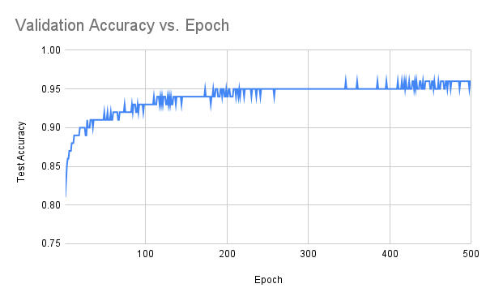

# Overview of Project

This is an assignment for Week 10 in the Northwestern Masters in Data Science [MSDS-431 Data Engineering with Go](https://msdsgo.netlify.app/data-engineering-with-go/) course.

The purpose of this assignment was to train a neural network entirely in Go, as a proof of concept that it can be done.  The target dataset was the [MNIST](https://en.wikipedia.org/wiki/MNIST_database) database of handwritten digits.  Ideally, the neural network would have been a convolutional neural network, taking advantage of the power convolutions bring to vision problems, but I was unable to get any of the publicly available go-based CNN packages to work so the model ended up being a dense deep neural network.

As always, this program was created on a mac, which has been tested for functionality.  We need to submit a windows version of the program, which should be identical but the windows version hasn't been tested.

# Engaging with the Code

The code to execute the assignment is located in two separate programs: a modeling_exe program and an analysis_exe program.  Both programs are run from a project home directory and rely on the presence of a ./results folder, as well as a ./data folder that contains the MNIST data.  The analysis program also requires the ./results/goIForestScores.csv file to be present, for comparison purposes.

## modeling_exe

With the modeling_exe in the project root directory, usage is:

```bash
./modeling_exe -epochs=N   // N is the number of epochs you want to use for training.  If left blank it will default to 500
```

This program will build the structure of the neural network, process the MNIST data, split the training data into a 70%/30% train/valid split, and begin training the model, running for N epochs with no early stopping.  It calculates model accuracy on the validation set after each epoch and on the test set after all epochs are finished.

Results of the model are then pushed out to ./results/goDNNScores.csv.

Note some high-level diagnostics are also run at the start, to demonstrate the data being analyzed.

## analysis_exe

With analysis_exe in the project root directory, usage is:

```bash
./analysis_exe -label=N  // N is a digit from 0-9
```

The analysis program ingests the ./results/goDNNScores.csv results from the modeling program, as well as the ./results/goIForestScores.csv results from the [MSDS-431 Wk 7 assignment](https://github.com/weswest/msds431wk7), where we evaluated the MNIST data for anomaly detection.  The program then produces the following analyses:

1. Iterates through each record to ensure that the index-label matches between the two files.  They should, since they're ingesting the same data, but this is an important validation step since index management proved to be a sticky point in both assignments
2. Produces a table of results that shows the average anomaly score for each label, segmented by those where the image was correctly classified by the model and those where the image was incorrectly classified
3. Produces an ascii-based image of four MNIST digits, in a 2x2 grid of whether the image was correctly or incorrectly classified by the DNN model and whether it had a low or high anomaly score.

Note that the label selected at the command line impacts which digit is used in item #3.  Further, I produced two anomaly scores in Week 7's assignment so the tables are duplicated: one for Score A and one for Score B.

# Results

## Model Structure and Testing

For this assignment, I used a dense DNN model where each of the 28x28 = 784 pixels of the MNIST data were treated as inputs.  The data was passed through two hidden layers of 32 and 64 nodes using ReLU activation, then pushed to a 10-node softmax output layer.

Considerations:
1. Model structure was lifted from my [MSDS-458 Deep Learning](https://github.com/weswest/MSDS458) coursework.  Our first assignment there was to test different DNN structures on the MNIST database, and I selected a structure that performed very well in that class's python implementation
2. No dropout or other regularization approaches were used, and there is no consistent random seed.  These certainly would have improved model performance, but this is a proof of concept
3. The model was trained with the Adam optimizer with a learning rate of 0.005, b1 of 0.9, b2 of 0.999, and epsilon of 1e-8.  Fiddling with the learning rate was a key determinant in getting models that consistently improved over time
4. As detailed below, I spent most of the week trying to get a convolutional neural network to work, without success.  More time certainly would have produced a better model.

## Performance Results

Unfortunately, I couldn't figure out how to use a seed initializer so every time the model program is built it produces a different model.  That said, I let the model run for 500 epochs and got this time series of validation accuracy per epoch, with a final test accuracy of ~96%:



### Model Accuracy
For more practical purposes, I have been using a model that is trained on 10 epochs for an overall model accuracy of ~86% on the test set.

| Label       | Accuracy |
|-------------|----------|
| 0           | 93%      |
| 1           | 94%      |
| 2           | 88%      |
| 3           | 84%      |
| 4           | 85%      |
| 5           | 81%      |
| 6           | 93%      |
| 7           | 88%      |
| 8           | 79%      |
| 9           | 83%      |
| **Grand Total** | **86%**  |


### Accuracy vs Anomaly Scores

In Week 7 we used the MNIST data to identify anomalous digits using a variety of different isolation forest algorithm implementations.  The general conclusion in Week 7 was that the go implementations were roughly in line with more mature / understood implementations in R and Python.  However, one of the takeaways in that assignment was that we were running the anomaly detection algorithm on the entire MNIST dataset, rather than creating a "label 2 identifier", a "label 5 identifier", etc.

With that as context, it's not surprising that there isn't a consistent correlation between anomaly score and accurate classification.  As shown above, the model is differentiated in its ability to classify certain digits, but I think the bigger driver of inconsistency is the anomaly identification.

**Anomaly Score Type: iForestAnomalyScore**
| Label | Avg Anomaly Score (Correct) | Avg Anomaly Score (Incorrect) |
|-------|-----------------------------|------------------------------|
| 0     | 0.093                       | 0.105                        |
| 1     | 0.151                       | 0.141                        |
| 2     | 0.105                       | 0.115                        |
| 3     | 0.115                       | 0.120                        |
| 4     | 0.125                       | 0.130                        |
| 5     | 0.117                       | 0.123                        |
| 6     | 0.120                       | 0.119                        |
| 7     | 0.127                       | 0.131                        |
| 8     | 0.122                       | 0.123                        |
| 9     | 0.132                       | 0.129                        |

**Anomaly Score Type: rForestNormalizedScore**
| Label | Avg Anomaly Score (Correct) | Avg Anomaly Score (Incorrect) |
|-------|-----------------------------|------------------------------|
| 0     | 0.322                       | 0.367                        |
| 1     | 0.790                       | 0.616                        |
| 2     | 0.353                       | 0.406                        |
| 3     | 0.419                       | 0.444                        |
| 4     | 0.492                       | 0.529                        |
| 5     | 0.434                       | 0.469                        |
| 6     | 0.440                       | 0.448                        |
| 7     | 0.515                       | 0.530                        |
| 8     | 0.437                       | 0.460                        |
| 9     | 0.548                       | 0.518                        |


### Visual Representation of Results

As noted above, the analysis program also prints-to-terminal sample MNIST images that fall into the 2x2 grid of high/low anomaly score and correct/incorrect classification.  Here are the results for label=8:

Showing label 8 images scored using the iForestAnomalyScore
Image IDs: upper left (UL): 46, BL: 386, UR: 720, and BR: 1758
Correct Prediction; High Anomaly Score		Incorrect Prediction (Predicted: 5 ); High Anomaly Score
                            		                            		
                            		                            		
                            		                            		
                            		                            		
                            		                            		
            1566421         		            14772           		
             1586771        		          1268885           		
          1334882177        		          3886782131        		
        1478888883781       		          4841751684        		
        587311488374        		          1785814863        		
       185     11671        		           48841771         		
       1871    1583         		           1685482          		
        48731  573          		            178861          		
        116861471           		             4882           		
           38882            		             1682           		
            5883            		             1884           		
          1583683           		             28871          		
          384 1772          		             48882          		
         1781  2861         		             58782          		
         3871   383         		             58482          		
         484    184         		             58582          		
         482    284         		             58782          		
         481   1583         		             48882          		
         177444884          		             18882          		
          2788851           		              5881          		
                            		                            		
                            		                            		
                            		                            		
Correct Prediction; Low Anomaly Score		Incorrect Prediction (Predicted: 9 ); Low Anomaly Score
                            		                            		
                            		                            		
                            		                            		
                            		                            		
                            		                            		
        11246888887773      		                 26783      		
       368887765331 23      		                3888872     		
      38873211              		               16842485     		
     38682                  		              178811585     		
    1881           1144     		              388733882     		
     5872221     126841     		             188888872      		
     2788887643115842       		             48888883       		
      26888888887821        		            588856841       		
         11 147888831       		           488832841        		
             27745884       		          288871371         		
            1783  5882      		        1288886 12          		
            4871  16871     		        2888783             		
           2882    2882     		       27872581             		
           485     4882     		      18884 781             		
           771    17882     		      4887  781             		
           77    178861     		     28881  771             		
           78211388871      		     2873   77              		
           5888888884       		     587    77              		
           288888862        		     584   387              		
            1586421         		     3861 2786              		
                            		                            		
                            		                            		
                            		                            		
Showing label 8 images scored using the rForestNormalizedScore
Image IDs: upper left (UL): 240, BL: 386, UR: 720, and BR: 1239
Correct Prediction; High Anomaly Score		Incorrect Prediction (Predicted: 5 ); High Anomaly Score
                            		                            		
                            		                            		
                            		                            		
                            		                            		
                            		                            		
            286211          		            14772           		
            673784          		          1268885           		
            64 178          		          3886782131        		
            682 68          		          4841751684        		
            2871121331      		          1785814863        		
             683357862      		           48841771         		
             4888863        		           1685482          		
             188851         		            178861          		
            28885           		             4882           		
           158885           		             1682           		
           584485           		             1884           		
          1661185           		             28871          		
          185 185           		             48882          		
          385 185           		             58782          		
          385 285           		             58482          		
          185 485           		             58582          		
              485           		             58782          		
              585           		             48882          		
            25872           		             18882          		
            3883            		              5881          		
                            		                            		
                            		                            		
                            		                            		
Correct Prediction; Low Anomaly Score		Incorrect Prediction (Predicted: 1 ); Low Anomaly Score
                            		                            		
                            		                            		
                            		                            		
                            		                            		
                            		                            		
        11246888887773      		                            		
       368887765331 23      		         1113448886531      		
      38873211              		       1158888888888841     		
     38682                  		      17888888777778882     		
    1881           1144     		      488887532   16884     		
     5872221     126841     		      788872       5885     		
     2788887643115842       		      78873       17885     		
      26888888887821        		      4886       117882     		
         11 147888831       		      37883      116882 13  		
             27745884       		       38871     136887771  		
            1783  5882      		       158871  48888888861  		
            4871  16871     		         588888888888841    		
           2882    2882     		         178888887753       		
           485     4882     		          6888875           		
           771    17882     		          688882            		
           77    178861     		          588881            		
           78211388871      		          288887            		
           5888888884       		          288888            		
           288888862        		          168888            		
            1586421         		           17886            		
                            		            1241       

Visual inspection reveals why it is likely some of these mis-classified images were mis-classified, especially since the model was trained without convolutional layers.

# Specific Answers to Specific Requirements (Assignment Requirements)

### Use the OCR digit data drawn from the GoMNIST repository. Use both training and test data.  Grayscale image processing is sufficient for this assignment.

Done.  See above.

### Identify open-source Go repositories for deep learning and image processing.

My ingoing approach was to find a go package that was natively equipped to produce convolutional neural networks.  Even better if the package also had native support for key modeling techniques like splitting data into train/validate and producing performance metrics.  Recency/activity of support was a secondary consideration.

I did google searches to try go get a list of repositories to explore, and then I cranked through them one by one to see if they could fit.

As shown in the tick-tock below, I went deep on github.com/LdDl/cnns, but ultimately failed to get the code to work.  I then restarted the process trying to find a package that could support deep neural network modeling and landed on go-deep.

* https://github.com/sjwhitworth/golearn.  Didn't apparently use convolutional neural networks
* https://github.com/galeone/tfgo.  Very promising, but when I got into the weeds it didn't appear like I could build convolutional neural networks at the level of granularity I was trying to
* https://github.com/TrizlyBear/PWS.  I looked into this briefly and it seemed like it had the building blocks necessary but that it would be a lot of work to get a convolutional neural network kicked off
* https://github.com/LdDl/cnns.  This seemed like it would work when I was reading the github, but key pieces of the example code wouldn't work.  This package had a pretty rich example of how to build a convolutional neural network on the MNIST database, so I gravitated to it since a lot could've been lift-and-dropped.  Unfortunately, as soon as I made any modifications to the code the models stopped working.  Additionally, the model development code had no native support for data segmentation (train v validate) and relatively little documentation on how to apply a trained model to an out of sample dataset.  I also faced a bug where I couldn't access the full training dataset after segmenting it into the train/validate subsets, even when I re-imported from scratch.  Seeing as it was a requirement of the assignment to run the trained model on the full dataset, this was ultimately a dealbreaker.  The fact that I was running a convolutional neural network on my non-GPU laptop slowed everything down too
* https://github.com/patrikeh/go-deep.  This is what I ultimately used for creating a dense deep neural network.  I abandoned the convolutional approach, which is unfortunate but sometimes time pressures mean you need to cut your losses.  This package has a lot of activity, including some commits earlier this year, plus it had native tools for segmenting the data into train / validate, and had built-in methods for producing performance metrics after each training epoch.

### Develop a digit classification model using a Go-based neural network (preferably a convolutional neural network). Ensure that vou emplov data science best practices in dividing the initial training data into training and validation sets and using the test data as a hold-test dataset for evaluating the constructed model.

Done.  While I tried to build a CNN, I had to fall back to a DNN with 784 inputs, then 32->64->10 nodes, as described above.  The 60k training dataset was split into a 70% train / 30% validation subset.  The final model was applied to a 10k test set.

Various model structures and hyperparameter settings were explored.

There's always more "best practice" data science that can be done, so I endeavored to get the big pieces right, recognizing there's more to do.

### Provide a complete report of the test performance, including images of the digits that are misclassified.  Note whether these misclassified images can be regarded as anomalous, as identified by an isolation forest.

Done.  See above.

### In the READMEmd file of the repository, describe your approach to finding Go repositories for deep learning and image processing. Review your process for building the digit classifier. Explain how to use vour svstem.

Done.  See above.

### Also, in the READMD.md file, to satisfy the requirements of robotic process automation, describe how vou would utilize Go across an OCR pipeline from image input to modeling (classification and recognition).

The advantage Go brings to the table is that it's super-fast.  So putting go into the pipeline for classification - for whatever reason - is because you want that piece of the code to have a speed boost.  The current issue, however, is that go doesn't have a great set of libraries for real-time image processing, currently requiring some passing back and forth between go and C.  This bottleneck weakens the ability to use go for the full OCR pipeline.

That said, this proof of concept does show that if there's a high volume of data coming in and the model needs to be retrained with more recent observations, there's certainly a potential solution where images are gathered and then the model is batch-retrained.

### Finally, in the READMemd file, demonstrate your Go programming expertise by listing vour Go programming repositories, providing a one-sentence description of each.

It's unclear whether this is referencing the repos used in this assignment, or the repos we've created for the class overall.  So here's both:

##### Repos used in this program
* encoding/csv: Package csv implements reading and writing operations for Comma-Separated Values (CSV) files.
* flag: Package flag implements command-line flag parsing.
* fmt: Package fmt implements formatted I/O with functions similar to C's printf and scanf.
* os: Package os provides a way to use operating system functionality.
* "github.com/patrikeh/go-deep": A Go library for deep neural networks.
* "github.com/patrikeh/go-deep/training": The training module for the Go deep neural network library.
* GoMNIST "github.com/petar/GoMNIST": A package for reading the MNIST dataset in Go.
* math: Package math provides basic constants and mathematical functions.
* sort: Package sort provides sorting of slices and user-defined collections.
* strconv: Package strconv implements conversions to and from string representations of basic data types.

##### Class Assignments
* [Week 2](https://github.com/weswest/msds431wk2).  Prove that you can create an OLS regression in Go that is functionally identical to the OLS results from R and Python
* [Week 3](https://github.com/weswest/msds431wk3).  Build a static website using Hugo, which relies on go (note: [my website](https://msds431wk3wes.netlify.app/))
* [Week 4](https://github.com/weswest/msds431wk4).  Replicate the .describe() functionality of python
* [Week 5](https://github.com/weswest/msds431wk5).  Build a web scraper using go
* [Week 6](https://github.com/weswest/msds431wk6).  Size out performance improvements from using go's concurrency model
* [Week 7](https://github.com/weswest/msds431wk7).  Using the isolation forest algorithm as an example, figure out how to find go packages that enable common Python / R functionality
* [Week 8](https://github.com/weswest/431wk8svelte).  Build a desktop application using wails and svelte and then also figure out how to get a command line program to execute another command line program (spoiler: you can't)
* [Week 9](https://github.com/weswest/msds431wk9).  Build another desktop application that can query an embedded database
* [Week 10](https://github.com/weswest/msds431wk10_2).  Build a neural network in go.

### Management Problem


A firm specializing in digital transformation has come to us with an interesting consulting and programming opportunity. Here is the gist of their request for proposal:

*We have been doing robotic process automation for a number of years, helping clients in digital transformation efforts. Unfortunately, many of our systems depend on legacy code and utilities, software that runs only on Windows operating systems. It may come as a surprise to you, but Visual Basic is the heart of our systems.*

*Going forward, we need to adopt a more capable and more secure programming environment We need to think in terms of cross-platform development. We need to develop systems that are maintainable over time. Go looks like a good fit for future versions of robotic process automation.*

*Optical character recognition (OCR) is critical robotic process automation. We use OCR in helping clients to move from paper to electronic documents. Here too, legacy systems abound. We are hoping that Go can provide a foundation for new OCR utilities and that these utilities will be easily (seamlessly) integrated into a comprehensive, Go-based system for robotic process automation.*

*Unfortunately, we lack Go expertise in our company. So, we are looking for a partner to help with our own digital transformation. In evaluating potential partners, we are asking firms to provide examples of their past Go projects, as well as an image processing demonstration. We are also looking for a plan for implementing an OCR pipeline from image capture to recognition. A classification model is central to this effort.*


### Grading Guidelines (100 Total Points)

* Coding rules, organization, and aesthetics (20 points). Effective use of Go modules and idiomatic Go. Code should be readable, easy to understand. Variable and function names should be meaningful, specific rather than abstract. They should not be too long or too short. Avoid useless temporary variables and intermediate results. Code blocks and line breaks should be clean and consistent. Break large code blocks into smaller blocks that accomplish one task at a time. Utilize readable and easy-to-follow control flow (if/else blocks and for loops). Distribute the not rather than the switch (and/or) in complex Boolean expressions. Programs should be self-documenting, with comments explaining the logic behind the code (McConnell 2004, 777–817).
* Testing and software metrics (20 points). Employ unit tests of critical components, generating synthetic test data when appropriate. Generate program logs and profiles when appropriate. Monitor memory and processing requirements of code components and the entire program. If noted in the requirements definition, conduct a Monte Carlo performance benchmark.
* Design and development (20 points). Employ a clean, efficient, and easy-to-understand design that meets all aspects of the requirements definition and serves the use case. When possible, develop general-purpose code modules that can be reused in other programming projects.
* Documentation (20 points). Effective use of Git/GitHub, including a README.md Markdown file for each repository, noting the roles of programs and data and explaining how to test and use the application.
* Application (20 points). Delivery of an executable load module or application (.exe file for Windows or .app file for MacOS). The application should run to completion without issues. If user input is required, the application should check for valid/usable input and should provide appropriate explanation to users who provide incorrect input. The application should employ clean design for the user experience and user interface (UX/UI).

### Assignment Deliverables

* Text string showing the link (URL) to the GitHub repository for the assignment
* README.md Markdown text file documentation for the assignment
* Zip compressed file with executable load module for the program/application (.exe for Windows or .app for MacOS)